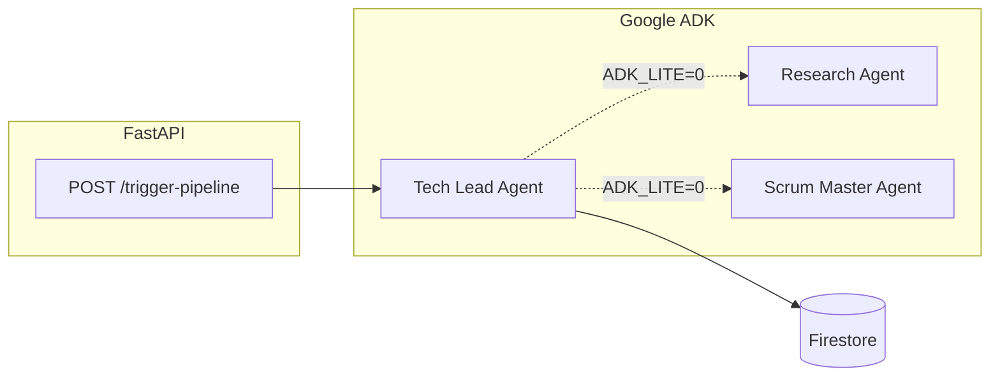

# Autonomous R&D System (Deep-Tech Sprint)

**Google Gen AI APAC Hackathon** — A multi-agent pipeline that takes one project prompt, persists structured context in **Firebase Firestore**, and coordinates **Google ADK** agents with tools. A **FastAPI** server exposes **`POST /trigger-pipeline`** so you can run the flow from **Swagger UI** or **Postman**.

---

## What it does today

| Area | Status |
|------|--------|
| **API** | `GET /` — quick info and example JSON · `GET /docs` — Swagger · **`POST /trigger-pipeline`** — runs the agent pipeline |
| **Agents (ADK)** | **Tech Lead** root agent; optional **Research** + **Scrum Master** sub-agents when `ADK_LITE=0` |
| **Memory** | Firestore collections: `project_memory`, `action_logs`, `run_history` |
| **Tools** | Real: save / retrieve / log / list / clear / summary (Firestore). **Mock:** `mock_search_arxiv`, `mock_create_ticket` (placeholders until real MCP integrations) |
| **MCP (calendar, Notion, etc.)** | Not wired in this repo yet — stubs are in `agents.py` for the hackathon merge |



---

## Prerequisites

- **Python 3.11+** (3.13 works with the team’s `.adk_env` setup)
- A **Google Cloud project** with:
  - **Firestore** enabled (Native mode)
  - A **service account** JSON with permission to use Firestore (e.g. **Cloud Datastore User** or a broader role your team agrees on)
- **Gemini access** via either:
  - **Vertex AI** (recommended if you have **GCP / hackathon credits**): enable **Vertex AI API**, link **billing**, grant the same (or another) service account **Vertex AI User** (`roles/aiplatform.user`), **or**
  - **Gemini Developer API**: an API key from [Google AI Studio](https://aistudio.google.com/apikey) — free tier is easy to exceed with multi-step agents

---

## Setup (beginner-friendly)

### 1. Clone and enter the project

```bash
cd autonomous-rnd-system
```

### 2. Create a virtual environment and install dependencies

```bash
python3 -m venv .adk_env
source .adk_env/bin/activate    # Windows: .adk_env\Scripts\activate
pip install -r requirements.txt
```

`requirements.txt` includes: `google-adk`, `fastapi`, `uvicorn`, `pydantic`, `python-dotenv`, `firebase-admin`, `rich`.

### 3. Firebase / Firestore

1. In [Firebase Console](https://console.firebase.google.com/), create or select a project (or use your GCP project with Firestore).
2. Enable **Firestore Database** (start in test mode for a hackathon only if you understand the rules; prefer production rules + auth for anything public).
3. In **Google Cloud Console** → **IAM & Admin** → **Service accounts** → your account → **Keys** → **Add key** → JSON.
4. Save the file **outside the repo** (e.g. `~/secrets/hackathon-sa.json`) or in a gitignored path — **never commit it**.

### 4. Environment variables

```bash
cp .env.example .env
```

Edit **`.env`**:

| Variable | Purpose |
|----------|---------|
| `GOOGLE_APPLICATION_CREDENTIALS` | **Required.** Absolute path to the service account JSON (Firestore + optional Vertex auth). |
| `GOOGLE_API_KEY` | **Developer API only.** Set if you are **not** using Vertex. Remove or comment when using Vertex so calls go through GCP auth. |
| `GOOGLE_GENAI_USE_VERTEXAI` | Set to `1` to use **Vertex AI** for Gemini. |
| `GOOGLE_CLOUD_PROJECT` | GCP project id (same as Firestore project if unified). |
| `GOOGLE_CLOUD_LOCATION` | e.g. `us-central1` (must support your model). |
| `ADK_MODEL` | Default in code: `gemini-2.5-flash`. Change if your region/backend requires another id. |
| `ADK_LITE` | `1` (default) = single agent, fewer LLM calls. `0` = full Tech Lead → Research → Scrum. |

**Vertex (typical hackathon with credits):**

```env
GOOGLE_APPLICATION_CREDENTIALS=/absolute/path/to/key.json
GOOGLE_GENAI_USE_VERTEXAI=1
GOOGLE_CLOUD_PROJECT=your-project-id
GOOGLE_CLOUD_LOCATION=us-central1
ADK_MODEL=gemini-2.5-flash
ADK_LITE=1
# Do NOT set GOOGLE_API_KEY
```

**Developer API only (no Vertex):**

```env
GOOGLE_APPLICATION_CREDENTIALS=/absolute/path/to/key.json
GOOGLE_API_KEY=your-key
ADK_LITE=1
# Omit or set GOOGLE_GENAI_USE_VERTEXAI=0
```

### 5. Run the API

```bash
source .adk_env/bin/activate
python main.py
```

- **App:** [http://localhost:8000](http://localhost:8000) — JSON info and example body  
- **Swagger:** [http://localhost:8000/docs](http://localhost:8000/docs) — use **POST `/trigger-pipeline`**

### 6. Test Firestore without the full app (optional)

```bash
python database.py
```

Writes sample docs to Firestore and prints retrieve output. Confirm data in the Firebase console.

---

## Using the pipeline from Swagger

1. Open **http://localhost:8000/docs**.
2. Expand **`POST /trigger-pipeline`** → **Try it out**.
3. Request body (example):

```json
{
  "prompt": "Design a 16-bit RISC processor in Verilog with ALU",
  "deadline": "2026-04-30",
  "project_key": "verilog_alu_demo"
}
```

4. **Execute**.  
   - **Response:** `status`, echoed `input`, `outcome.summary`, `outcome.event_count`, `meta` (`model`, `adk_lite`), timestamps.  
   - **Terminal:** colored logs (agents, tool calls).  
5. On success, a row is appended to Firestore **`run_history`**.

---

## Project layout

| File | Role |
|------|------|
| `main.py` | FastAPI app, `InMemoryRunner`, session per `project_key`, Rich logging, 429 retry |
| `agents.py` | ADK `Agent` definitions, `ADK_MODEL` / `ADK_LITE`, mock tools, `tech_lead_agent` |
| `database.py` | Firebase init, Firestore CRUD, `memory_tools_phase3` for the Tech Lead |
| `requirements.txt` | Python dependencies |
| `.env.example` | Template for secrets and flags (copy to `.env`) |

### Imports for teammates

- **Member 1 (orchestration):** `from agents import tech_lead_agent` · tools are already bound; swap mocks for real MCP toolsets when ready.
- **Member 3 contract:** `from database import memory_tools_phase3` or individual functions: `save_project_context`, `retrieve_context`, `log_agent_action`, `log_run_history`.

---

## Troubleshooting

| Symptom | What to check |
|---------|----------------|
| `FileNotFoundError` for service account | `GOOGLE_APPLICATION_CREDENTIALS` path is wrong or file missing; use an **absolute** path. |
| `429` / `RESOURCE_EXHAUSTED` | Free tier is tiny for long tool loops. Use **`ADK_LITE=1`**, wait between runs, switch **`ADK_MODEL`**, or use **Vertex + billing/credits**. |
| Firestore permission errors | Service account has Firestore access on that project. |
| Vertex errors | **Vertex AI API** enabled, **billing** on project, service account has **Vertex AI User**, `GOOGLE_CLOUD_PROJECT` / `GOOGLE_CLOUD_LOCATION` correct; **unset `GOOGLE_API_KEY`**. |
| `GET /` returns 404 in browser | Use **`GET /`** on port 8000; root is defined. If you see 404, confirm you are hitting this app, not another process. |

---

## Security

- **Never commit** `.env` or service account JSON (this repo gitignores `.env`).
- Restrict Firestore rules before any public deployment.

---

## License / credits

Built for the **Google Gen AI APAC Hackathon**. Adjust team names and demo script as needed.
