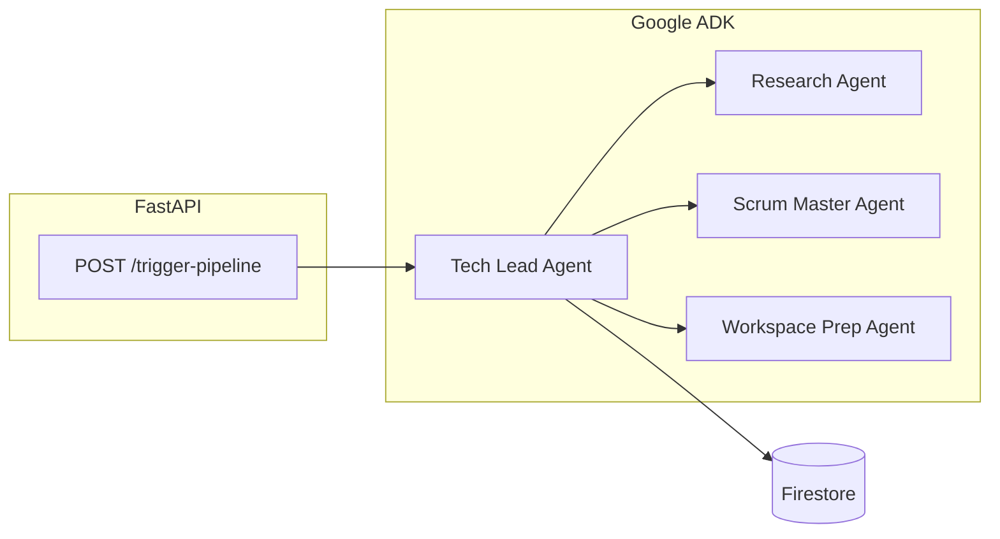

# Autonomous R&D System (Deep-Tech Sprint)

**Google Gen AI APAC Hackathon** — A multi-agent pipeline that takes one project prompt, persists structured context in **Firebase Firestore**, and coordinates **Google ADK** agents with tools. A **FastAPI** server exposes **`POST /trigger-pipeline`** so you can run the flow from **Swagger UI** or **Postman**.

---

## What it does today

| Area | Status |
|------|--------|
| **API** | **`GET /`** — web UI (static `frontend/`) · **`GET /api`** — JSON service info · **`GET /health`** — probe · **`GET /docs`** — Swagger · **`POST /trigger-pipeline`** — agent pipeline · **`/mcp/`** — **MCP** (Streamable HTTP); **`/mcp`** → **`/mcp/`** |
| **Agents (ADK)** | **Tech Lead** root with **Research**, **Scrum Master**, and **Workspace Prep** sub-agents (always). `ADK_LITE` only changes the **user prompt** in `main.py`; it does **not** remove sub-agents. |
| **Memory** | Firestore collections: `project_memory`, `action_logs`, `run_history` |
| **Tools** | Firestore (`database.py`) · **Web search** (`research_tool.search_web_snippets`, **`ddgs`** metasearch, no API key) · **arXiv** (optional in `research_tool.py`) · **Notion** (`notion_tool.py`) · **Calendar** (`calendar_tool.py`) · **Disk** (`workspace_tool.py`). |



---

## How to run (from zero)

From the project root, in order:

```bash
# 1) Virtual environment
python3 -m venv .adk_env

# 2) Activate it
source .adk_env/bin/activate          # macOS / Linux
# .adk_env\Scripts\activate           # Windows cmd
# .adk_env\Scripts\Activate.ps1       # Windows PowerShell

# 3) Dependencies
pip install --upgrade pip
pip install -r requirements.txt

# 4) Environment file (edit with your keys — see table below)
cp .env.example .env

# 5) Google Calendar OAuth once (if you use Calendar tools)
python auth_setup.py

# 6) Start the API
python main.py
```

Then open **http://localhost:8000/** for the **web UI** (same origin as the API), or **http://localhost:8000/docs** for Swagger. **`GET /api`** returns JSON service metadata.  
**Docker / Cloud Run:** see **[DEPLOY.md](./DEPLOY.md)**.  
Optional: `python database.py` to sanity-check Firestore; `python test_member2.py` to exercise Scrum + Notion + Calendar.

**Workspace output:** After a run that delegates to Workspace Prep, check **`generated_workspaces/`** (or `WORKSPACE_OUTPUT_DIR` in `.env`). That folder is gitignored.

**Research:** `search_web_snippets` uses the **`ddgs`** package (outbound HTTP; rotates backends such as auto / Bing / DuckDuckGo). Optional env: **`WEB_SEARCH_TIMEOUT`** (seconds), **`WEB_SEARCH_BACKEND`** (`auto`, `bing`, `duckduckgo`). If results are empty, try `WEB_SEARCH_BACKEND=bing`. Uninstall legacy **`duckduckgo-search`** if you still see a rename warning. `search_arxiv` uses **export.arxiv.org** when the agent calls it.

---

## Running in Google Cloud Shell (Easiest)

If you want to skip local setups and run everything directly in your browser, Google Cloud Shell is the easiest method.

1. Open [Google Cloud Shell](https://shell.cloud.google.com/).
2. Clone the repository and navigate into it:
   ```bash
   git clone <your-repo-url>
   cd autonomous-rnd-system
   ```
3. Create a virtual environment and install dependencies:
   ```bash
   python3 -m venv .adk_env
   source .adk_env/bin/activate
   pip install -r requirements.txt
   ```
4. Copy `.env.example` to `.env` and fill in your keys (you can upload your `key.json` via the Cloud Shell three-dot menu -> Upload):
   ```bash
   cp .env.example .env
   ```
5. Start the application:
   ```bash
   python main.py
   ```
6. Click the **Web Preview** icon (the eye symbol) at the top right of the Cloud Shell terminal and click **Preview on port 8000** to see the web UI and Swagger docs.

### Deploying to Cloud Run (From Cloud Shell)

To push the application to a live public URL using Google Cloud Run, you can run the following commands to enable the necessary APIs, prepare the artifact registry, and deploy with your secrets configured as environment variables:

```bash
# 1) Enable required Google Cloud APIs
gcloud services enable run.googleapis.com artifactregistry.googleapis.com cloudbuild.googleapis.com secretmanager.googleapis.com

# 2) Create an Artifact Registry repository (Cloud Run source deploys use this by default)
gcloud artifacts repositories create cloud-run-source-deploy --repository-format=docker --location=us-central1

# 3) Create a Google Cloud Secret containing your token.json file
gcloud secrets create calendar-token --data-file=token.json

# 4) Deploy the app with your environment variables and mount the secret
gcloud run deploy autonomous-rnd-system \
  --source . \
  --region=us-central1 \
  --allow-unauthenticated \
  --port=8080 \
  --set-env-vars="ADK_MODEL=gemini-2.5-flash,GOOGLE_GENAI_USE_VERTEXAI=1,GOOGLE_CLOUD_PROJECT=YOUR_PROJECT_ID,GOOGLE_CLOUD_LOCATION=us-central1,NOTION_TOKEN=YOUR_NOTION_TOKEN,NOTION_DATABASE_ID=YOUR_NOTION_DATABASE_ID,GOOGLE_CALENDAR_ID=YOUR_EMAIL@gmail.com,GOOGLE_CLIENT_ID=YOUR_GOOGLE_CLIENT_ID,GOOGLE_CLIENT_SECRET=YOUR_GOOGLE_CLIENT_SECRET,NOTION_RUNS_PARENT_PAGE_ID=YOUR_NOTION_PAGE_ID,NOTION_RUN_USE_KANBAN_DB=1" \
  --set-secrets="/app/token.json=calendar-token:latest"
```

---

## Notion modes

| Mode | Env | Behavior |
|------|-----|----------|
| **Runs hub (default)** | `NOTION_RUNS_PARENT_PAGE_ID` set | Each `POST /trigger-pipeline` creates a **child page** under that hub. Tasks are appended as **to-do blocks** on that page (no extra database). Response includes `notion.run_page_url`. |
| **Runs + per-run Kanban** | `NOTION_RUNS_PARENT_PAGE_ID` + `NOTION_RUN_USE_KANBAN_DB=1` | Same child page, plus a **new database** on that page per run. Property names are read from Notion after create (works with API 2025-09-03). |
| **Template only** | `NOTION_RUNS_PARENT_PAGE_ID` unset | `create_kanban_card` / `list_kanban_cards` use **`NOTION_DATABASE_ID`** only (e.g. a shared RnD Task Board). |

**Integration access:** The Runs **hub page** must be connected to your integration (**⋯ → Connections**, or Share → add the integration — not the same as “public to web”). Otherwise Notion returns “Could not find page”.

**ADK + threads:** Tool calls may run on a worker thread where `ContextVar` is empty. The app mirrors the active run into short-lived **`_RND_NOTION_REQ_*` environment variables** during each request so Notion tools still target the correct page or database. This is aimed at **one pipeline at a time** per process; heavy concurrent traffic could theoretically clash.

**Card body formatting:** `create_kanban_card` turns descriptions into real Notion blocks (bullets, numbered lists, `**bold**`, optional `###` headings). Optional **`sources`** (newline-separated lines with URLs) is rendered under **Sources & references** with clickable links. The Scrum agent is instructed to pass research URLs there.

---

## Prerequisites

- **Python 3.11+** (3.13 works with a local venv such as `.adk_env`)
- A **Google Cloud project** with:
  - **Firestore** enabled (Native mode)
  - A **service account** JSON with permission to use Firestore (e.g. **Cloud Datastore User** or a role your team agrees on)
- **Gemini access** via either:
  - **Vertex AI** (recommended if you have **GCP / hackathon credits**): enable **Vertex AI API**, link **billing**, grant the service account **Vertex AI User** (`roles/aiplatform.user`), **or**
  - **Gemini Developer API**: an API key from [Google AI Studio](https://aistudio.google.com/apikey) — free tier is easy to exceed with multi-step agents
- **Notion:** Integration token; **connect** it to your **Runs hub** page and (if used) your **template** Kanban database.
- **Google Calendar:** OAuth **Desktop** client in GCP with **Google Calendar API** enabled; run `auth_setup.py` once to create `token.json`.
- **Outbound HTTP** for **web search** (`ddgs`) and optional **arXiv** from wherever `python main.py` runs.

---

## Setup (beginner-friendly)

### 1. Clone and enter the project

```bash
cd autonomous-rnd-system
```

### 2. Create a virtual environment and install dependencies

```bash
python3 -m venv .adk_env
source .adk_env/bin/activate    # Windows: .adk_env\Scripts\activate
pip install -r requirements.txt
```

`requirements.txt` includes: `google-adk`, `fastapi`, **`fastmcp`**, `uvicorn`, `pydantic`, `python-dotenv`, `firebase-admin`, `rich`, `notion-client`, **`ddgs`**, `google-api-python-client`, `google-auth-httplib2`, `google-auth-oauthlib`.

### 3. Firebase / Firestore

1. In [Firebase Console](https://console.firebase.google.com/), create or select a project (or use your GCP project with Firestore).
2. Enable **Firestore Database** (test mode is only for hacks you fully understand; prefer production rules for anything exposed).
3. In **Google Cloud Console** → **IAM & Admin** → **Service accounts** → your account → **Keys** → **Add key** → JSON.
4. Save the file **outside the repo** or in a gitignored path — **never commit it**.

### 4. Environment variables

```bash
cp .env.example .env
```

Edit **`.env`**:

| Variable | Purpose |
|----------|---------|
| `GOOGLE_APPLICATION_CREDENTIALS` | **Required.** Absolute path to the service account JSON (Firestore + optional Vertex auth). |
| `GOOGLE_API_KEY` | **Developer API only.** Set if you are **not** using Vertex. Remove or leave unset when using Vertex. |
| `GOOGLE_GENAI_USE_VERTEXAI` | Set to `1` to use **Vertex AI** for Gemini. |
| `GOOGLE_CLOUD_PROJECT` | GCP project id (same as Firestore project if unified). |
| `GOOGLE_CLOUD_LOCATION` | e.g. `us-central1` (must support your model). |
| `ADK_MODEL` | Default in code: `gemini-2.5-flash`. Change if your region/backend requires another id. |
| `ADK_LITE` | `1` = leaner tool-use wording; **Scrum / Notion + Calendar are still required** when the request is project work with a deadline. `0` (default if unset) = fuller coordination text. **Sub-agents are always attached**; `ADK_LITE` only changes the user prompt. |
| `NOTION_TOKEN` | Notion integration secret. |
| `NOTION_DATABASE_ID` | Template Kanban database id when **not** using Runs mode, or for `python notion_tool.py` tests. Still recommended when using Runs mode for local tooling. |
| `NOTION_RUNS_PARENT_PAGE_ID` | Optional. **Runs hub** page id (from URL). Each POST creates a child page; tasks go there as to-dos unless `NOTION_RUN_USE_KANBAN_DB=1`. |
| `NOTION_RUN_USE_KANBAN_DB` | `1` = create a **new database** on each run page instead of to-do blocks. |
| `NOTION_DATA_SOURCE_ID` | Optional. Notion API **2025-09-03** may need the **data source** id (Database → **Manage data sources**). |
| `NOTION_PROP_TITLE`, `NOTION_PROP_STATUS`, `NOTION_PROP_DATE` | Optional overrides for **`NOTION_DATABASE_ID` only**. Must match that board’s real property names; wrong values cause “property does not exist” errors. |
| `GOOGLE_CLIENT_ID` / `GOOGLE_CLIENT_SECRET` | OAuth *Desktop* client for Calendar API. |
| `GOOGLE_CALENDAR_ID` | Optional; default `primary`. |
| `WEB_SEARCH_MAX_RESULTS` | Optional; default `8` (cap 15). Hits per `search_web_snippets` call. |
| `WEB_SEARCH_TIMEOUT` | Optional; default `30` seconds (clamped 5–120). HTTP timeout for `ddgs`. |
| `WEB_SEARCH_BACKEND` | Optional; default `auto`. Try `bing` if searches often return no results. |
| `ARXIV_MAX_RESULTS` | Optional; default `5` (cap 15). Papers per `search_arxiv` (fallback). |
| `WORKSPACE_OUTPUT_DIR` | Optional; default `generated_workspaces` — root for `prepare_project_workspace`. |
| `MCP_AUTH_TOKEN` | Optional. If set, MCP at **`/mcp/`** requires **`Authorization: Bearer <token>`** or **`X-MCP-API-Key: <token>`**. If unset or empty, **`/mcp/` is open** (local dev only). |

**Vertex (typical hackathon with credits):**

```env
GOOGLE_APPLICATION_CREDENTIALS=/absolute/path/to/key.json
GOOGLE_GENAI_USE_VERTEXAI=1
GOOGLE_CLOUD_PROJECT=your-project-id
GOOGLE_CLOUD_LOCATION=us-central1
ADK_MODEL=gemini-2.5-flash
ADK_LITE=1
# Do NOT set GOOGLE_API_KEY
```

### 4b. Google Calendar token (one-time)

After `.env` has `GOOGLE_CLIENT_ID` and `GOOGLE_CLIENT_SECRET`:

```bash
python auth_setup.py
```

A browser opens; sign in and allow access. This writes **`token.json`** in the project root (`calendar_tool.py` reads it). Re-run if you revoke access or need a new refresh token.

**Developer API only (no Vertex):**

```env
GOOGLE_APPLICATION_CREDENTIALS=/absolute/path/to/key.json
GOOGLE_API_KEY=your-key
ADK_LITE=1
# Omit or set GOOGLE_GENAI_USE_VERTEXAI=0
```

### 5. Run the API
### 6. Run the API

With the venv **activated** (see **How to run** above):

```bash
python main.py
```

- **App:** [http://localhost:8000](http://localhost:8000) — JSON info and example body  
- **Swagger:** [http://localhost:8000/docs](http://localhost:8000/docs) — use **POST `/trigger-pipeline`**
- **MCP:** [http://127.0.0.1:8000/mcp/](http://127.0.0.1:8000/mcp/) — same process as the API; see below.

### 5b. MCP (FastMCP) — URL and testing
### 7. MCP (FastMCP) — URL and testing

**Exact path (same origin as the UI/API):**

| Environment | MCP base URL |
|-------------|----------------|
| Local default (`python main.py`) | **`http://127.0.0.1:8000/mcp/`** (trailing slash; required by the ASGI mount) |
| Cloud Run | **`https://<your-service-host>/mcp/`** |

**`/mcp`** without a trailing slash responds with **307** to **`/mcp/`** so clients that only know the short path still work.

Implementation: `mcp_bridge.py` builds a **FastMCP** server and `main.py` mounts its HTTP ASGI app at **`/mcp`** (before the static **`/`** catch-all). Tools mirror research, Firestore memory, Notion Kanban, and Calendar helpers used by the ADK agents.

**Auth:** If **`MCP_AUTH_TOKEN`** is set in the environment, every MCP HTTP request must include either:

- **`Authorization: Bearer <MCP_AUTH_TOKEN>`**, or  
- **`X-MCP-API-Key: <MCP_AUTH_TOKEN>`**

Otherwise the server responds with **401** JSON. If **`MCP_AUTH_TOKEN`** is unset or empty, **`/mcp/` is unauthenticated** — use only on trusted localhost.

**How to test**

1. **Start the server** the same way as always: `python main.py` (or Docker / Cloud Run). MCP is not a separate service.
2. **List tools** with the FastMCP CLI (after `pip install -r requirements.txt`):

```bash
# No token (only when MCP_AUTH_TOKEN is unset)
fastmcp list http://127.0.0.1:8000/mcp/ -t http

# With a shared secret (same value as MCP_AUTH_TOKEN on the server)
fastmcp list http://127.0.0.1:8000/mcp/ -t http --auth your-judge-secret
```

The CLI sends the token as a **Bearer** token; the server also accepts **`X-MCP-API-Key`** for non–FastMCP clients. If `fastmcp list` is not available, use any MCP-over-HTTP client pointed at that URL with the same headers. **`GET /health`** and **`POST /trigger-pipeline`** are unchanged — MCP and the agent pipeline are independent surfaces on one app.

### 6. Test Firestore without the full app (optional)
### 8. Test Firestore without the full app (optional)

```bash
python database.py
```

Writes sample docs to Firestore and prints retrieve output. Confirm data in the Firebase console.

---

## Using the pipeline from Swagger

1. Open **http://localhost:8000/docs**.
2. Expand **`POST /trigger-pipeline`** → **Try it out**.
3. Request body (example):

```json
{
  "prompt": "Design a 16-bit RISC processor in Verilog with ALU",
  "deadline": "2026-04-30",
  "project_key": "verilog_alu_demo"
}
```

4. **Execute**.  
   - **Response:** `status`, echoed `input`, `outcome.summary`, `outcome.event_count`, `meta` (`model`, `adk_lite`, optional Notion fields), timestamps.  
   - If Runs mode is on: **`notion.run_page_url`**, **`notion.run_page_id`**, **`notion.kanban_cards_created`** (whether any **`create_kanban_card`** ran); **`notion.kanban_database_id`** only when `NOTION_RUN_USE_KANBAN_DB=1`.  
   - **`meta.notion_kanban_cards_created`**, **`meta.notion_guard_nudges`**: if a run workspace was opened but the model skipped Scrum, **`main.py`** sends up to **two** follow-up nudges so **`scrum_master_agent`** runs; if cards still never appear, **`meta.notion_guard_warning`** explains that.  
   - On final **429** failure: **`quota_hint`**.  
   - On Notion hub access failure: **`notion_setup_hint`** (JSON `status: error`).  
   - **Terminal:** colored logs (agents, tool calls); you may see **`Notion guard:`** when a nudge runs.  
5. On success, a row is appended to Firestore **`run_history`**.

---

## Project layout

| File | Role |
|------|------|
| `main.py` | FastAPI app, static **`frontend/`** at **`/`**, **`/mcp/`** MCP mount (+ **`/mcp`** → **`/mcp/`** redirect), **`/health`**, **`/api`**, CORS, `InMemoryRunner`, Notion run workspace, **Notion guard**, Rich logging, Vertex/Gemini **429** retries, friendly Notion API errors |
| `mcp_bridge.py` | **FastMCP** HTTP app + optional **`MCP_AUTH_TOKEN`** gate; tools delegate to `research_tool`, `database`, `notion_tool`, `calendar_tool` |
| `agents.py` | ADK agents: Tech Lead (must delegate to Scrum for deadline-bearing project work), Research (concise bullets), Scrum (Notion + Calendar + **`sources`** on cards), Workspace Prep (disk) |
| `research_tool.py` | `search_web_snippets` (**`ddgs`**, backend fallbacks) · `search_arxiv` (optional) |
| `workspace_tool.py` | `prepare_project_workspace` — `docs/`, `src/`, README under `WORKSPACE_OUTPUT_DIR` |
| `database.py` | Firebase init, Firestore CRUD, `memory_tools` / `memory_tools_phase3` |
| `notion_tool.py` | Runs hub child page, to-do blocks or per-run DB, markdown-ish description → Notion blocks, optional **`sources`** section, template DB + data-source schema, request env mirror for tools |
| `calendar_tool.py` | Free slots + Deep Work blocks (timezone-aware vs Calendar API) |
| `auth_setup.py` | One-time OAuth → `token.json` for Calendar |
| `test_member2.py` | Async test: Scrum tools + Notion + Calendar |
| `requirements.txt` | Python dependencies |
| `Dockerfile` | Container image: uvicorn on **`$PORT`**, ships **`frontend/`** with the API |
| `DEPLOY.md` | Cloud Run / Docker smoke tests and route reference |
| `.env.example` | Template for secrets and flags (copy to `.env`) |

### Imports for teammates

- **Orchestration / API:** `from agents import tech_lead_agent, ADK_MODEL, ADK_LITE`
- **Memory tools:** `from database import memory_tools_phase3` or `save_project_context`, `retrieve_context`, `log_agent_action`, `log_run_history`

---

## Troubleshooting

| Symptom | What to check |
|---------|----------------|
| `FileNotFoundError` for service account | `GOOGLE_APPLICATION_CREDENTIALS` path is wrong or file missing; use an **absolute** path. |
| `429` / `RESOURCE_EXHAUSTED` | Wait between runs; **`ADK_LITE=1`**; try another **`ADK_MODEL`**; Vertex billing and quotas. Response may include **`quota_hint`**. See [ADK Gemini 429](https://google.github.io/adk-docs/agents/models/google-gemini/#error-code-429-resource_exhausted). |
| Firestore permission errors | Service account has Firestore access on that project. |
| Vertex errors | **Vertex AI API** enabled, **billing** on project, service account has **Vertex AI User**, `GOOGLE_CLOUD_PROJECT` / `GOOGLE_CLOUD_LOCATION` correct; **unset `GOOGLE_API_KEY`**. |
| Notion “Could not find page” / 404 on hub | **Connections**: open the Runs hub → **⋯** → connect your integration (not only “public to web”). Response includes **`notion_setup_hint`**. |
| Notion `KeyError('properties')` / data source | Set **`NOTION_DATA_SOURCE_ID`** from **Manage data sources**; integration can access the database. |
| Notion “Status / … is not a property” | Remove wrong **`NOTION_PROP_*`** values or match them to **`NOTION_DATABASE_ID`**. With Runs + Kanban DB mode, per-run schema is fetched automatically. |
| Run page opens but **no Kanban cards** | Check JSON **`notion.kanban_cards_created`** and **`meta.notion_guard_warning`**. Confirm **`scrum_master_agent`** / **`create_kanban_card`** appear in logs; fix Calendar OAuth if Scrum fails early. |
| Web search empty or flaky | Set **`WEB_SEARCH_BACKEND=bing`**, increase **`WEB_SEARCH_TIMEOUT`**; confirm **`pip install ddgs`** and remove old **`duckduckgo-search`**. |
| Calendar OAuth errors | **Calendar API** enabled; OAuth consent + **test users** if needed; Desktop client id/secret in `.env`. |
| UI or `/health` returns 404 | Confirm port (**`PORT`** / default **8000**) and that **`frontend/`** exists in the deployed image. |

---

## Security

- **Never commit** `.env`, **`token.json`**, or service account JSON (use `.gitignore`).
- Restrict Firestore rules before any public deployment.
- For any **public** URL (e.g. Cloud Run), set **`MCP_AUTH_TOKEN`** and pass the header from judges’ MCP clients. An empty or missing token leaves **`/mcp/`** open.

---

## License / credits

Built for the **Google Gen AI APAC Hackathon**.
