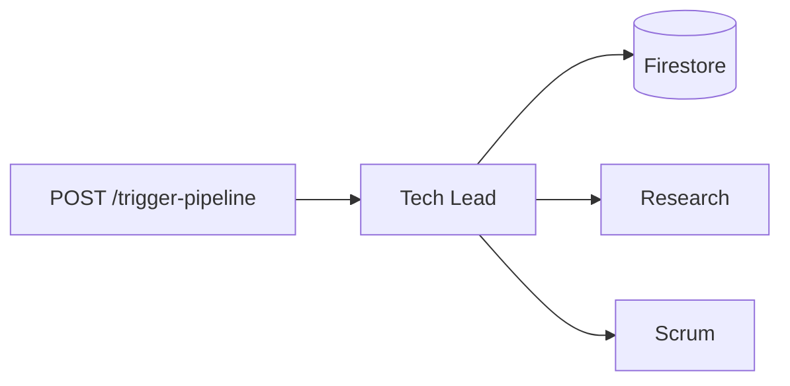

# Autonomous R&D System (Deep-Tech Sprint)

**Google Gen AI APAC Hackathon** — One prompt in, structured planning out: **Firestore** memory, **Google ADK** multi-agent orchestration, **Notion** + **Google Calendar**, web research, optional on-disk workspace prep. A single **FastAPI** app serves the **web UI**, **REST API**, **Swagger**, and **MCP** (`/mcp/`) on the same origin.

**Hackathon brief (how we satisfy it)** — *Multi-agent task, schedule, and information management across tools and data:*

| Requirement | This project |
|-------------|----------------|
| **Primary agent + sub-agents** | **Tech Lead** delegates to **Research**, and **Scrum Master**. |
| **Structured database** | **Firestore** — project memory, action logs, run history (read/write via agent tools). |
| **MCP + real tools** | **`/mcp/`** exposes the same capabilities; **Google Calendar** (blocks/slots), **Notion** (Kanban / run pages), **web + arXiv** research. |
| **Multi-step workflows** | One **`POST /trigger-pipeline`** run chains memory → research (when needed) → Scrum (tasks + calendar) 
| **API-first deployment** | **FastAPI** + **Swagger**; ships to **Cloud Run** as a single HTTP service. |

**Goal:** Show agents, tools, and persisted context working together on a realistic planning workflow (not a single-shot chat reply).

---

## What it does

| Piece | Detail |
|--------|--------|
| **Trigger** | `POST /trigger-pipeline` with `prompt`, `deadline`, `project_key` |
| **Agents** | **Tech Lead** coordinates **Research** (web + arXiv), **Scrum Master** (Notion + Calendar) |
| **Memory** | Firestore: `project_memory`, `action_logs`, `run_history` |
| **MCP** | Streamable HTTP at **`/mcp/`** (trailing slash); optional `MCP_AUTH_TOKEN` |



---

## Quick start (local)

```bash
python3 -m venv .adk_env
source .adk_env/bin/activate   # Windows: .adk_env\Scripts\activate
pip install -r requirements.txt
cp .env.example .env            # fill in values (see below)
python auth_setup.py            # optional: Calendar OAuth → token.json
python main.py
```

- **UI:** `http://localhost:8000/` (port from `PORT`, default **8000**)
- **Swagger:** `http://localhost:8000/docs`
- **Health:** `GET /health`
- **MCP:** `http://127.0.0.1:8000/mcp/`

**Optional checks:** `python database.py` (Firestore smoke test) · `python test_member2.py` (Notion + Calendar path)

---

## Prerequisites

- **Python 3.11+**
- **GCP:** Firestore enabled; service account JSON for the app (`GOOGLE_APPLICATION_CREDENTIALS`)
- **Gemini:** either **Vertex AI** (`GOOGLE_GENAI_USE_VERTEXAI=1`, billing + Vertex API + `roles/aiplatform.user` on the runtime identity) **or** **AI Studio** (`GOOGLE_API_KEY` — do not set when using Vertex)
- **Notion:** integration token + page/database shared with the integration
- **Calendar:** OAuth **Desktop** client, Calendar API enabled, `token.json` from `auth_setup.py` (run locally; upload `token.json` to Cloud Shell / mount on Cloud Run — see below)

---

## Environment variables

Copy **`.env.example`** → **`.env`**. Commonly required:

| Variable | Notes |
|----------|--------|
| `GOOGLE_APPLICATION_CREDENTIALS` | Absolute path to service account JSON |
| `GOOGLE_CLOUD_PROJECT` / `GOOGLE_CLOUD_LOCATION` | e.g. `us-central1` |
| `GOOGLE_GENAI_USE_VERTEXAI` | `1` for Vertex; then leave `GOOGLE_API_KEY` unset |
| `ADK_MODEL` | e.g. `gemini-2.5-flash` (must exist on your Vertex region / API) |
| `ADK_LITE` | `1` = leaner prompt, fewer redundant tool calls; sub-agents stay on. `0` = fuller prompt text |
| `NOTION_TOKEN` | Integration secret |
| `NOTION_DATABASE_ID` | Template Kanban DB (and tooling); see Notion modes |
| `NOTION_RUNS_PARENT_PAGE_ID` | Optional “Runs hub” page id |
| `GOOGLE_CLIENT_ID` / `GOOGLE_CLIENT_SECRET` | Must match the OAuth client used to create `token.json` |
| `MCP_AUTH_TOKEN` | Set on any **public** URL so `/mcp/` is not open |

Full list and comments: **`.env.example`**.

### Calendar token (`token.json`)

- **`auth_setup.py`** uses a local redirect server — run it on the **same machine** as the browser (your laptop), not only in Cloud Shell.
- App resolution order (see `calendar_tool.py`): **`/secrets/token.json`** if that path exists, else **`token.json`** relative to the process working directory (Dockerfile **`WORKDIR /app`**).

---

## Notion modes (short)

| Setup | Behavior |
|--------|----------|
| `NOTION_RUNS_PARENT_PAGE_ID` set | Each run creates a **child page** under the hub; tasks as **to-dos** on that page unless… |
| … + `NOTION_RUN_USE_KANBAN_DB=1` | Also creates a **per-run Kanban database** on that page |
| Hub unset | `create_kanban_card` / `list_kanban_cards` use **`NOTION_DATABASE_ID`** only |

Connect the integration to the hub page (**Share / Connections**), not only “public to web”.

---

## API cheat sheet

| Method / path | Purpose |
|---------------|---------|
| `GET /` | Static UI (`frontend/`) |
| `GET /health` | Liveness JSON |
| `GET /api` | Service metadata |
| `GET /docs` | Swagger |
| `POST /trigger-pipeline` | Run the agent pipeline (JSON body: `prompt`, `deadline`, `project_key`) |
| `GET /mcp/` | MCP (Streamable HTTP); `GET /mcp` → **307** → `/mcp/` |

Example body:

```json
{
  "prompt": "Plan a 2-day MVP: habit tracker with login",
  "deadline": "2026-04-30",
  "project_key": "habit_mvp"
}
```

### MCP auth

If `MCP_AUTH_TOKEN` is set, send **`Authorization: Bearer <token>`** or **`X-MCP-API-Key: <token>`**.

```bash
fastmcp list http://127.0.0.1:8000/mcp/ -t http --auth your-secret
```

---

## Google Cloud Shell (run locally in the browser)

Use this to install deps and test before deploy.

```bash
git clone <your-repo-url> && cd autonomous-rnd-system
python3 -m venv .adk_env
source .adk_env/bin/activate
pip install --upgrade pip
pip install -r requirements.txt
cp .env.example .env
# Edit .env (or export vars). Calendar: run auth_setup.py on your laptop, upload token.json via Cloud Shell ⋮ → Upload.
python main.py
```

**Web Preview:** Cloud Shell toolbar → **Preview** → **port 8000** (match `PORT` if you change it).

---

## Deploy to Cloud Run (`gcloud run deploy --source`)

### Before you deploy

1. **Project & billing** — In [Cloud Console](https://console.cloud.google.com/), pick the right **project**. Billing must be **linked** to that project (Vertex and Cloud Run need it).
2. **CLI auth & project** (Cloud Shell or local with `gcloud`):

   ```bash
   gcloud auth login                    # if needed
   gcloud config set project YOUR_GCP_PROJECT_ID
   gcloud config get-value project      # sanity check
   ```

3. **Enable APIs** (once per project):

   ```bash
   gcloud services enable run.googleapis.com cloudbuild.googleapis.com \
     artifactregistry.googleapis.com secretmanager.googleapis.com \
     aiplatform.googleapis.com firestore.googleapis.com
   ```

4. **Firestore** — Create a **Firestore (Native)** database in the same project if you have not already.

5. **Calendar token in Secret Manager** — From a machine that has `token.json`:

   ```bash
   gcloud secrets create calendar-token --data-file=token.json
   ```

   Grant the **Cloud Run runtime service account** **`secretmanager.secretAccessor`** on `calendar-token` (Console → Secret Manager → calendar-token → **Permissions**, or IAM). Default Cloud Run SA is often `PROJECT_NUMBER-compute@developer.gserviceaccount.com`.

6. **Runtime IAM (same service account)** — At minimum for this app: **Vertex AI User** (`roles/aiplatform.user`) if `GOOGLE_GENAI_USE_VERTEXAI=1`, and Firestore/Datastore access (e.g. **Cloud Datastore User** or a Firebase-compatible role your team uses). See **[DEPLOY.md](./DEPLOY.md)** for Docker smoke tests and more detail.

### Deploy command (template)

**Do not put real API keys or tokens in git or in screenshots.** Replace placeholders. Prefer Secret Manager for `NOTION_TOKEN` and `GOOGLE_CLIENT_SECRET` instead of long `--set-env-vars` strings (see [DEPLOY.md](./DEPLOY.md)).

- **Vertex (typical hackathon):** set `GOOGLE_GENAI_USE_VERTEXAI=1`, set `GOOGLE_CLOUD_PROJECT` / `GOOGLE_CLOUD_LOCATION`, and **omit `GOOGLE_API_KEY`** so the service account is used. Set `ADK_MODEL` to a model that exists in your region (e.g. `gemini-2.5-flash`).
- **Gemini API key only:** set `GOOGLE_API_KEY`, set `GOOGLE_GENAI_USE_VERTEXAI=0` (or unset), and do not rely on Vertex for that path.

`calendar_tool.py` loads **`/secrets/token.json`** first if that file exists, so mount the secret there:

```bash
gcloud run deploy autonomous-rnd-system \
  --source . \
  --region=us-central1 \
  --allow-unauthenticated \
  --port=8080 \
  --set-env-vars="GOOGLE_GENAI_USE_VERTEXAI=1,ADK_MODEL=gemini-2.5-flash,GOOGLE_CLOUD_PROJECT=YOUR_GCP_PROJECT_ID,GOOGLE_CLOUD_LOCATION=us-central1,NOTION_TOKEN=YOUR_NOTION_TOKEN,NOTION_DATABASE_ID=YOUR_NOTION_DATABASE_ID,GOOGLE_CALENDAR_ID=your.email@gmail.com,GOOGLE_CLIENT_ID=YOUR_OAUTH_CLIENT_ID.apps.googleusercontent.com,GOOGLE_CLIENT_SECRET=YOUR_OAUTH_CLIENT_SECRET,NOTION_RUNS_PARENT_PAGE_ID=YOUR_NOTION_PAGE_ID,NOTION_RUN_USE_KANBAN_DB=1" \
  --set-secrets="/secrets/token.json=calendar-token:latest"
```

Adjust names (`autonomous-rnd-system`, `calendar-token`, region) to match your project. After deploy, open the printed **Service URL**, hit **`/health`**, then **`/`** or **`/docs`**.

**More:** artifact-registry-only builds, MCP hardening, and secret-as-env patterns — **[DEPLOY.md](./DEPLOY.md)**.

---

## Troubleshooting

| Issue | Check |
|-------|--------|
| Vertex **404** on model | `ADK_MODEL` valid for `GOOGLE_CLOUD_LOCATION`; see [Vertex model versions](https://cloud.google.com/vertex-ai/generative-ai/docs/learn/model-versions) |
| **429** / quota | Space runs; `ADK_LITE=1`; try another `ADK_MODEL`; [ADK Gemini 429](https://google.github.io/adk-docs/agents/models/google-gemini/#error-code-429-resource_exhausted) |
| Notion “Could not find page” | Integration **connected** to the hub / database |
| No Kanban cards | Logs for `scrum_master_agent` / `create_kanban_card`; response `meta.notion_guard_*`; Calendar OAuth |
| `token.json` missing | Path + same `GOOGLE_CLIENT_ID` / `GOOGLE_CLIENT_SECRET` as when the token was issued |
| Web search empty | `WEB_SEARCH_BACKEND=bing`, `WEB_SEARCH_TIMEOUT` |

---

## Repo layout

| Path | Role |
|------|------|
| `main.py` | FastAPI app, static UI, pipeline, Notion run workspace, MCP lifespan |
| `agents.py` | ADK agents + `ADK_MODEL` / `ADK_LITE` |
| `mcp_bridge.py` | FastMCP HTTP app |
| `database.py` | Firestore + memory tools |
| `notion_tool.py` / `calendar_tool.py` / `research_tool.py` / `workspace_tool.py` | Integrations |
| `auth_setup.py` | OAuth → `token.json` |
| `frontend/` | Web UI |
| `DEPLOY.md` | Docker & Cloud Run |
| `.env.example` | Env template |

---

## Security

- Never commit **`.env`**, **`token.json`**, or service account JSON (see `.gitignore`). If keys ever appear in chat, issues, or history, **rotate** them in Google Cloud / Notion and redeploy.
- Tighten Firestore rules before any public exposure.
- Set **`MCP_AUTH_TOKEN`** on public Cloud Run URLs.

---

Built for the **Google Gen AI APAC Hackathon**.
