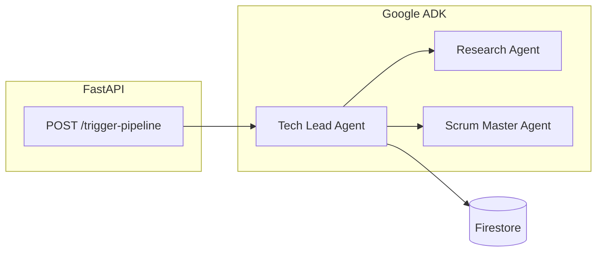

# Autonomous R&D System (Deep-Tech Sprint)

**Google Gen AI APAC Hackathon** — A multi-agent pipeline that takes one project prompt, persists structured context in **Firebase Firestore**, and coordinates **Google ADK** agents with tools. A **FastAPI** server exposes **`POST /trigger-pipeline`** so you can run the flow from **Swagger UI** or **Postman**.

---

## What it does today

| Area | Status |
|------|--------|
| **API** | `GET /` — quick info and example JSON · `GET /docs` — Swagger · **`POST /trigger-pipeline`** — runs the agent pipeline |
| **Agents (ADK)** | **Tech Lead** root with **Research** + **Scrum Master** sub-agents (always). `ADK_LITE` in `.env` only changes the **user prompt** in `main.py` (lite wording asks the model to minimize tool calls); it does **not** remove sub-agents. |
| **Memory** | Firestore collections: `project_memory`, `action_logs`, `run_history` |
| **Tools** | Firestore memory (`database.py`) · **Notion** (`notion_tool.py`) — see **Notion modes** below · **Google Calendar** (`calendar_tool.py`) · Research uses **`mock_search_arxiv`** (placeholder). |



---

## Notion modes

| Mode | Env | Behavior |
|------|-----|----------|
| **Runs hub (default)** | `NOTION_RUNS_PARENT_PAGE_ID` set | Each `POST /trigger-pipeline` creates a **child page** under that hub. Tasks are appended as **to-do blocks** on that page (no extra database). Response includes `notion.run_page_url`. |
| **Runs + per-run Kanban** | `NOTION_RUNS_PARENT_PAGE_ID` + `NOTION_RUN_USE_KANBAN_DB=1` | Same child page, plus a **new database** on that page per run. Property names are read from Notion after create (works with API 2025-09-03). |
| **Template only** | `NOTION_RUNS_PARENT_PAGE_ID` unset | `create_kanban_card` / `list_kanban_cards` use **`NOTION_DATABASE_ID`** only (e.g. a shared RnD Task Board). |

**Integration access:** The Runs **hub page** must be connected to your integration (**⋯ → Connections**, or Share → add the integration — not the same as “public to web”). Otherwise Notion returns “Could not find page”.

**ADK + threads:** Tool calls may run on a worker thread where `ContextVar` is empty. The app mirrors the active run into short-lived **`_RND_NOTION_REQ_*` environment variables** during each request so Notion tools still target the correct page or database. This is aimed at **one pipeline at a time** per process; heavy concurrent traffic could theoretically clash.

---

## Prerequisites

- **Python 3.11+** (3.13 works with a local venv such as `.adk_env`)
- A **Google Cloud project** with:
  - **Firestore** enabled (Native mode)
  - A **service account** JSON with permission to use Firestore (e.g. **Cloud Datastore User** or a role your team agrees on)
- **Gemini access** via either:
  - **Vertex AI** (recommended if you have **GCP / hackathon credits**): enable **Vertex AI API**, link **billing**, grant the service account **Vertex AI User** (`roles/aiplatform.user`), **or**
  - **Gemini Developer API**: an API key from [Google AI Studio](https://aistudio.google.com/apikey) — free tier is easy to exceed with multi-step agents
- **Notion:** Integration token; **connect** it to your **Runs hub** page and (if used) your **template** Kanban database.
- **Google Calendar:** OAuth **Desktop** client in GCP with **Google Calendar API** enabled; run `auth_setup.py` once to create `token.json`.

---

## Setup (beginner-friendly)

### 1. Clone and enter the project

```bash
cd autonomous-rnd-system
```

### 2. Create a virtual environment and install dependencies

```bash
python3 -m venv .adk_env
source .adk_env/bin/activate    # Windows: .adk_env\Scripts\activate
pip install -r requirements.txt
```

`requirements.txt` includes: `google-adk`, `fastapi`, `uvicorn`, `pydantic`, `python-dotenv`, `firebase-admin`, `rich`, `notion-client`, `google-api-python-client`, `google-auth-httplib2`, `google-auth-oauthlib`.

### 3. Firebase / Firestore

1. In [Firebase Console](https://console.firebase.google.com/), create or select a project (or use your GCP project with Firestore).
2. Enable **Firestore Database** (test mode is only for hacks you fully understand; prefer production rules for anything exposed).
3. In **Google Cloud Console** → **IAM & Admin** → **Service accounts** → your account → **Keys** → **Add key** → JSON.
4. Save the file **outside the repo** or in a gitignored path — **never commit it**.

### 4. Environment variables

```bash
cp .env.example .env
```

Edit **`.env`**:

| Variable | Purpose |
|----------|---------|
| `GOOGLE_APPLICATION_CREDENTIALS` | **Required.** Absolute path to the service account JSON (Firestore + optional Vertex auth). |
| `GOOGLE_API_KEY` | **Developer API only.** Set if you are **not** using Vertex. Remove or leave unset when using Vertex. |
| `GOOGLE_GENAI_USE_VERTEXAI` | Set to `1` to use **Vertex AI** for Gemini. |
| `GOOGLE_CLOUD_PROJECT` | GCP project id (same as Firestore project if unified). |
| `GOOGLE_CLOUD_LOCATION` | e.g. `us-central1` (must support your model). |
| `ADK_MODEL` | Default in code: `gemini-2.5-flash`. Change if your region/backend requires another id. |
| `ADK_LITE` | `1` = API sends “lite” instructions (ask model to minimize tool calls). `0` (default in code if unset) = fuller coordination wording. **Sub-agents always run.** |
| `NOTION_TOKEN` | Notion integration secret. |
| `NOTION_DATABASE_ID` | Template Kanban database id when **not** using Runs mode, or for `python notion_tool.py` tests. Still recommended when using Runs mode for local tooling. |
| `NOTION_RUNS_PARENT_PAGE_ID` | Optional. **Runs hub** page id (from URL). Each POST creates a child page; tasks go there as to-dos unless `NOTION_RUN_USE_KANBAN_DB=1`. |
| `NOTION_RUN_USE_KANBAN_DB` | `1` = create a **new database** on each run page instead of to-do blocks. |
| `NOTION_DATA_SOURCE_ID` | Optional. Notion API **2025-09-03** may need the **data source** id (Database → **Manage data sources**). |
| `NOTION_PROP_TITLE`, `NOTION_PROP_STATUS`, `NOTION_PROP_DATE` | Optional overrides for **`NOTION_DATABASE_ID` only**. Must match that board’s real property names; wrong values cause “property does not exist” errors. |
| `GOOGLE_CLIENT_ID` / `GOOGLE_CLIENT_SECRET` | OAuth *Desktop* client for Calendar API. |
| `GOOGLE_CALENDAR_ID` | Optional; default `primary`. |

**Vertex (typical hackathon with credits):**

```env
GOOGLE_APPLICATION_CREDENTIALS=/absolute/path/to/key.json
GOOGLE_GENAI_USE_VERTEXAI=1
GOOGLE_CLOUD_PROJECT=your-project-id
GOOGLE_CLOUD_LOCATION=us-central1
ADK_MODEL=gemini-2.5-flash
ADK_LITE=1
# Do NOT set GOOGLE_API_KEY
```

### 4b. Google Calendar token (one-time)

After `.env` has `GOOGLE_CLIENT_ID` and `GOOGLE_CLIENT_SECRET`:

```bash
python auth_setup.py
```

A browser opens; sign in and allow access. This writes **`token.json`** in the project root (`calendar_tool.py` reads it). Re-run if you revoke access or need a new refresh token.

**Developer API only (no Vertex):**

```env
GOOGLE_APPLICATION_CREDENTIALS=/absolute/path/to/key.json
GOOGLE_API_KEY=your-key
ADK_LITE=1
# Omit or set GOOGLE_GENAI_USE_VERTEXAI=0
```

### 5. Run the API

```bash
source .adk_env/bin/activate
python main.py
```

- **App:** [http://localhost:8000](http://localhost:8000) — JSON info and example body  
- **Swagger:** [http://localhost:8000/docs](http://localhost:8000/docs) — use **POST `/trigger-pipeline`**

### 6. Test Firestore without the full app (optional)

```bash
python database.py
```

Writes sample docs to Firestore and prints retrieve output. Confirm data in the Firebase console.

---

## Using the pipeline from Swagger

1. Open **http://localhost:8000/docs**.
2. Expand **`POST /trigger-pipeline`** → **Try it out**.
3. Request body (example):

```json
{
  "prompt": "Design a 16-bit RISC processor in Verilog with ALU",
  "deadline": "2026-04-30",
  "project_key": "verilog_alu_demo"
}
```

4. **Execute**.  
   - **Response:** `status`, echoed `input`, `outcome.summary`, `outcome.event_count`, `meta` (`model`, `adk_lite`, optional Notion URLs), timestamps.  
   - If Runs mode is on: **`notion.run_page_url`** and **`notion.run_page_id`**; **`notion.kanban_database_id`** only when `NOTION_RUN_USE_KANBAN_DB=1`.  
   - On final **429** failure: **`quota_hint`**.  
   - On Notion hub access failure: **`notion_setup_hint`** (JSON `status: error`).  
   - **Terminal:** colored logs (agents, tool calls).  
5. On success, a row is appended to Firestore **`run_history`**.

---

## Project layout

| File | Role |
|------|------|
| `main.py` | FastAPI app, `InMemoryRunner`, session per `project_key`, Notion run workspace before agent, Rich logging, Vertex/Gemini **429** retries with backoff, friendly Notion API errors |
| `agents.py` | ADK agents: Tech Lead (`memory_tools_phase3`), Research (`mock_search_arxiv`), Scrum (Notion + Calendar) |
| `database.py` | Firebase init, Firestore CRUD, `memory_tools` / `memory_tools_phase3` |
| `notion_tool.py` | Runs hub child page, to-do blocks or per-run DB, template DB + data-source schema, request env mirror for tools |
| `calendar_tool.py` | Free slots + Deep Work blocks (timezone-aware vs Calendar API) |
| `auth_setup.py` | One-time OAuth → `token.json` for Calendar |
| `test_member2.py` | Async test: Scrum tools + Notion + Calendar |
| `requirements.txt` | Python dependencies |
| `.env.example` | Template for secrets and flags (copy to `.env`) |

### Imports for teammates

- **Orchestration / API:** `from agents import tech_lead_agent, ADK_MODEL, ADK_LITE`
- **Memory tools:** `from database import memory_tools_phase3` or `save_project_context`, `retrieve_context`, `log_agent_action`, `log_run_history`

---

## Troubleshooting

| Symptom | What to check |
|---------|----------------|
| `FileNotFoundError` for service account | `GOOGLE_APPLICATION_CREDENTIALS` path is wrong or file missing; use an **absolute** path. |
| `429` / `RESOURCE_EXHAUSTED` | Wait between runs; **`ADK_LITE=1`**; try another **`ADK_MODEL`**; Vertex billing and quotas. Response may include **`quota_hint`**. See [ADK Gemini 429](https://google.github.io/adk-docs/agents/models/google-gemini/#error-code-429-resource_exhausted). |
| Firestore permission errors | Service account has Firestore access on that project. |
| Vertex errors | **Vertex AI API** enabled, **billing** on project, service account has **Vertex AI User**, `GOOGLE_CLOUD_PROJECT` / `GOOGLE_CLOUD_LOCATION` correct; **unset `GOOGLE_API_KEY`**. |
| Notion “Could not find page” / 404 on hub | **Connections**: open the Runs hub → **⋯** → connect your integration (not only “public to web”). Response includes **`notion_setup_hint`**. |
| Notion `KeyError('properties')` / data source | Set **`NOTION_DATA_SOURCE_ID`** from **Manage data sources**; integration can access the database. |
| Notion “Status / … is not a property” | Remove wrong **`NOTION_PROP_*`** values or match them to **`NOTION_DATABASE_ID`**. With Runs + Kanban DB mode, per-run schema is fetched automatically. |
| Calendar OAuth errors | **Calendar API** enabled; OAuth consent + **test users** if needed; Desktop client id/secret in `.env`. |
| `GET /` returns 404 | Confirm you are on port **8000** and hitting this app’s process. |

---

## Security

- **Never commit** `.env`, **`token.json`**, or service account JSON (use `.gitignore`).
- Restrict Firestore rules before any public deployment.

---

## License / credits

Built for the **Google Gen AI APAC Hackathon**. Adjust team names and demo script as needed.
