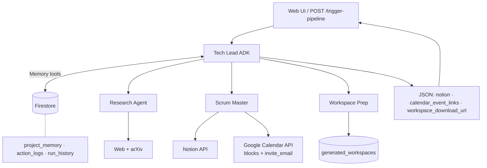

# Autonomous R&D System (Deep-Tech Sprint)

From a single mission brief to structured, persistent outputs: **Firestore** memory, **Google ADK** multi-agent orchestration, **Notion** Kanban and run workspaces, **Google Calendar** deep-work blocks with **guest invitations**, live web research, optional **on-disk workspace** scaffolding, and a **web control dashboard** served alongside the API.

---

## Capabilities at a glance

| Area | Implementation |
|------|----------------|
| **Orchestration** | **Tech Lead** coordinates **Research** (web + arXiv), **Scrum Master** (Notion + Calendar), and **Workspace Prep** (filesystem layout + README). |
| **Persistence** | **Firestore** for project memory, action logs, and **run history** (including data for the dashboard sidebar). |
| **Tooling & MCP** | **`/mcp/`** exposes Calendar, Notion helpers, and research tools over Streamable HTTP, aligned with the REST pipeline behavior. |
| **Workflow** | **`POST /trigger-pipeline`** sequences memory → optional research → Scrum (tasks, dates, calendar, Notion) → optional workspace artifacts and download links. |
| **Operations & UI** | **FastAPI**, **OpenAPI (Swagger)**, static **`/`** dashboard, and **Cloud Run**–friendly packaging for a single HTTP service. |

---

## Feature highlights

### Multi-agent brain

- **Tech Lead** — Loads/stores `project_key` memory, breaks work into owned tasks (title, assignee, acceptance criteria, risks, estimates), routes to sub-agents, enforces structured refinement (modified / added / unchanged tasks).
- **Research** — `search_web_snippets` (live HTTP) + optional **`search_arxiv`** for papers; URLs flow into Notion card **sources**.
- **Scrum Master** — **`spread_task_dates`** spreads milestones from **today (IST)** through the mission **deadline**; **`get_free_slots`** / **`get_team_free_slots`** for availability when calendars are shared with the OAuth account; **`create_kanban_card`** + **`list_kanban_cards`** for Notion.
- **Workspace Prep** — **`prepare_project_workspace`** creates a starter tree on disk; downloads can be surfaced via **`GET /api/download-workspace/{filename}`** when configured.

### Google Calendar (beyond “one block”)

- **Deep Work blocks** — Per-task events with IST timezone, reminders, dedupe/update when the same summary already exists.
- **Invite-by-email (`invite_email`)** — Events are created on the **OAuth organizer** calendar; assignees from the team roster are added as **attendees** with **`sendUpdates=all`** so **Google sends normal invitation emails** (no custom SMTP). Teammates don’t need write access to your calendar for that path.
- **Alternate hosts / calendars** — Optional **`calendar_email`** when the token can write that calendar ID (e.g. shared calendar).
- **API → UI** — Successful runs expose **`calendar_event_links`** (parsed from tool output); the dashboard matches both **`calendar.google.com`** and **`www.google.com`** event URLs so links reliably appear as clickable cards.

### Notion

- **Per-run workspace** — Under **`NOTION_RUNS_PARENT_PAGE_ID`**: child page per run, optional **per-run Kanban DB** when **`NOTION_RUN_USE_KANBAN_DB=1`**.
- **Rich cards** — Detailed descriptions (objectives, DoD, risks), deadlines aligned with Scrum dates, assignee routing by name.

### Team configuration (UI + API)

- Toggle **Team configuration**, generate rows, capture **name / role / email**.
- Payload includes **`team_members`** (and optional **`num_teammates`**) so agents assign real people; emails drive **`invite_email`** for Calendar and availability tooling where calendars are shared.

### Refinement loop

- **`POST /refine`** — Same project key, new instruction; Tech Lead merges changes without blindly regenerating everything.
- **Chat bar + modal** — Refine from the main composer or from the results modal after a run.

### Web dashboard (`frontend/`)

- **Live execution graph** — Animated pipeline stages with connector SVG; **scrollable / responsive** graph area for small screens.
- **Building artifacts banner** — Visible while a run is active; reminds that Notion + Calendar can take **minutes** on large scopes.
- **Agent thinking overlay** — Frosted full-screen overlay with loader while pipeline/refine HTTP calls complete; blocks stray clicks until results are ready.
- **Results modal** — Summary + **Notion** and **Temporal blocks** in a **two-column** layout on wide screens; **spam / Promotions** hint for Google Calendar emails.
- **Past runs** — Local cache + **`GET /api/run-history`** merge so history survives refreshes when Firestore stores lightweight snapshots.
- **Telemetry strip** — Live log aesthetic for agent/tool chatter.
- **Theme toggle** — Dark / light glass aesthetic.
- **IST clock** in the sidebar.

### API extras

| Endpoint | Role |
|----------|------|
| **`POST /trigger-pipeline`** | Full run (`prompt`, `deadline`, `project_key`, optional `team_members`). |
| **`POST /refine`** | Incremental update for an existing `project_key`. |
| **`GET /api/run-history`** | JSON history for the Past Runs panel. |
| **`GET /api/download-workspace/{filename}`** | Serve generated workspace zips when present. |
| **`GET /health`**, **`GET /docs`**, **`GET /api`** | Ops + Swagger + metadata. |
| **`/mcp/`** | MCP Streamable HTTP (optional **`MCP_AUTH_TOKEN`**). |

Example body with team:

```json
{
  "prompt": "Plan a habit tracker MVP with auth",
  "deadline": "2026-05-15",
  "project_key": "habit_demo",
  "team_members": [
    { "name": "Alex", "role": "Backend", "email": "alex@example.com" },
    { "name": "Jordan", "role": "Frontend", "email": "jordan@example.com" }
  ]
}
```

---

## Architecture (data flow)


```mermaid
flowchart TB
  UI["Web UI / POST /trigger-pipeline"] --> TL[Tech Lead ADK]

  TL <-->|"Memory tools"| FS[(Firestore)]
  FS -.- MEM["project_memory · action_logs · run_history"]

  TL --> R[Research Agent]
  R --> WEB["Web + arXiv"]

  TL --> S[Scrum Master]
  S --> N[Notion API]
  S --> GC["Google Calendar API<br/>blocks + invite_email"]

  TL --> W[Workspace Prep]
  W --> DISK[(generated_workspaces)]

  TL --> OUT["JSON: notion · calendar_event_links · workspace_download_url"]
  OUT --> UI
```

---

## Quick start (local)

```bash
python3 -m venv .adk_env
source .adk_env/bin/activate   # Windows: .adk_env\Scripts\activate
pip install -r requirements.txt
cp .env.example .env            # fill in values (see below)
python auth_setup.py            # Calendar OAuth → token.json (run on your laptop)
python main.py
```

| URL | Purpose |
|-----|---------|
| **`/`** | Dashboard UI (`frontend/`) |
| **`/docs`** | Swagger |
| **`/health`** | Liveness |
| **`/mcp/`** | MCP (Streamable HTTP) |

**Smoke tests:** `python database.py` · `python test_member2.py` (where present)

---

## Prerequisites

- **Python 3.11+**
- **GCP:** Firestore; **`GOOGLE_APPLICATION_CREDENTIALS`** service account
- **Gemini:** **Vertex AI** (`GOOGLE_GENAI_USE_VERTEXAI=1`, billing + **`roles/aiplatform.user`**) **or** **AI Studio** (`GOOGLE_API_KEY` — don’t mix with Vertex unless you know the split)
- **Notion:** integration token + pages/databases shared with the integration
- **Calendar:** OAuth **Desktop** client, Calendar API enabled, **`token.json`** from **`auth_setup.py`** (then Secret Manager on Cloud Run — see deploy section)

---

## Environment variables

Copy **`.env.example`** → **`.env`**. Highlights:

| Variable | Notes |
|----------|--------|
| `GOOGLE_APPLICATION_CREDENTIALS` | Path to service account JSON |
| `GOOGLE_CLOUD_PROJECT` / `GOOGLE_CLOUD_LOCATION` | Vertex region (e.g. `us-central1`) |
| `GOOGLE_GENAI_USE_VERTEXAI` | `1` for Vertex |
| `ADK_MODEL` | e.g. `gemini-2.5-flash` |
| `ADK_LITE` | Leaner prompts / fewer redundant tools (`1` typical) |
| `NOTION_TOKEN`, `NOTION_DATABASE_ID`, `NOTION_RUNS_PARENT_PAGE_ID`, `NOTION_RUN_USE_KANBAN_DB` | Notion layout |
| `GOOGLE_CLIENT_ID` / `GOOGLE_CLIENT_SECRET` | Must match the OAuth client used for **`token.json`** |
| `GOOGLE_CALENDAR_ID` | Organizer calendar id (often your Gmail) |
| `MCP_AUTH_TOKEN` | Lock down **`/mcp/`** on public URLs |
| `CORS_ALLOW_ORIGINS` / `CORS_ALLOW_ORIGIN_REGEX` | Extra browser origins for the UI |

Full comments: **`.env.example`**.

### Calendar token

- Run **`auth_setup.py`** on the **same machine as the browser** (localhost OAuth redirect).
- Resolution order in **`calendar_tool.py`**: **`/secrets/token.json`** if present, else **`token.json`** in the working directory.

---

## Notion modes (short)

| Setup | Behavior |
|--------|----------|
| `NOTION_RUNS_PARENT_PAGE_ID` set | Child **run page** under hub; tasks as to-dos unless Kanban mode is on |
| … + `NOTION_RUN_USE_KANBAN_DB=1` | **Per-run Kanban database** on that page |
| Hub unset | Cards use **`NOTION_DATABASE_ID`** template |

Share the hub / DB with the **Notion integration**, not only “public to web”.

---

## MCP auth

If **`MCP_AUTH_TOKEN`** is set:

`Authorization: Bearer <token>` **or** `X-MCP-API-Key: <token>`

```bash
fastmcp list http://127.0.0.1:8000/mcp/ -t http --auth your-secret
```

---

## Google Cloud Shell

```bash
git clone <your-repo-url> && cd autonomous-rnd-system
python3 -m venv .adk_env && source .adk_env/bin/activate
pip install -r requirements.txt
cp .env.example .env
# Upload token.json from laptop if using Calendar
python main.py
```

**Preview:** Cloud Shell → **Preview** → port **`8000`** (or your **`PORT`**).

---

## Deploy to Cloud Run (`gcloud run deploy --source`)

1. **Billing + APIs** — `run`, `cloudbuild`, `artifactregistry`, `secretmanager`, `aiplatform`, `firestore` enabled  
2. **Firestore Native** database  
3. **Secret** — `gcloud secrets versions add calendar-token --data-file=token.json`  
4. **IAM** — Runtime SA → **`secretmanager.secretAccessor`** on that secret; **Vertex AI User** when using Vertex  

Mount token at **`/secrets/token.json`**:

```bash
gcloud run deploy autonomous-rnd-system \
  --source . \
  --region=us-central1 \
  --allow-unauthenticated \
  --port=8080 \
  --set-env-vars="GOOGLE_GENAI_USE_VERTEXAI=1,ADK_MODEL=gemini-2.5-flash,GOOGLE_CLOUD_PROJECT=YOUR_PROJECT,GOOGLE_CLOUD_LOCATION=us-central1,NOTION_TOKEN=...,NOTION_DATABASE_ID=...,GOOGLE_CALENDAR_ID=you@gmail.com,GOOGLE_CLIENT_ID=....apps.googleusercontent.com,GOOGLE_CLIENT_SECRET=...,NOTION_RUNS_PARENT_PAGE_ID=...,NOTION_RUN_USE_KANBAN_DB=1" \
  --set-secrets="/secrets/token.json=calendar-token:latest"
```

Replace placeholders; prefer Secret Manager for long-lived secrets in production — see **`DEPLOY.md`**.

---

## Troubleshooting

| Symptom | What to check |
|---------|----------------|
| **No Calendar links in UI** | OAuth / `token.json`; logs for `❌ Calendar`; teammate **`invite_email`** must be passed by the Scrum agent when roster has emails |
| **No invitation email** | Google sends invites, not SMTP — spam/promotions; Workspace may restrict external guests |
| **429 / quota** | Space runs; `ADK_LITE=1`; alternate `ADK_MODEL`; [ADK 429 doc](https://google.github.io/adk-docs/agents/models/google-gemini/#error-code-429-resource-exhausted) |
| **Notion “page not found”** | Integration **connected** to hub / DB |
| **`invalid_grant`** | Rotate OAuth secret if leaked; delete old **`token.json`**; re-run **`auth_setup.py`** |
| **Vertex 404 model** | Model exists in **`GOOGLE_CLOUD_LOCATION`** |

---

## Repo layout

| Path | Role |
|------|------|
| **`main.py`** | FastAPI: pipeline, refine, static UI, run history API, workspace downloads, MCP lifespan |
| **`agents.py`** | ADK agents (Tech Lead, Research, Scrum, Workspace) + model defaults |
| **`database.py`** | Firestore + memory / history tools |
| **`notion_tool.py`** | Notion run workspace + Kanban |
| **`calendar_tool.py`** | Calendar blocks, spreads, free/busy, **`invite_email`** |
| **`research_tool.py`** | Web + arXiv |
| **`workspace_tool.py`** | On-disk scaffold |
| **`mcp_bridge.py`** | FastMCP HTTP bridge |
| **`auth_setup.py`** | OAuth → **`token.json`** |
| **`frontend/`** | Dashboard UI (graph, modal, past runs, overlay) |
| **`DEPLOY.md`** | Deeper deploy notes |
| **`.env.example`** | Environment template |

---

## Security

- Never commit **`.env`**, **`token.json`**, or service account JSON. Rotate anything that appeared in chat or screenshots.  
- Tighten **Firestore rules** before public exposure.  
- Set **`MCP_AUTH_TOKEN`** when **`/mcp/`** is on the public internet.

---

Multi-agent planning with integrated tools, durable context, and a production-style API plus operator UI.

